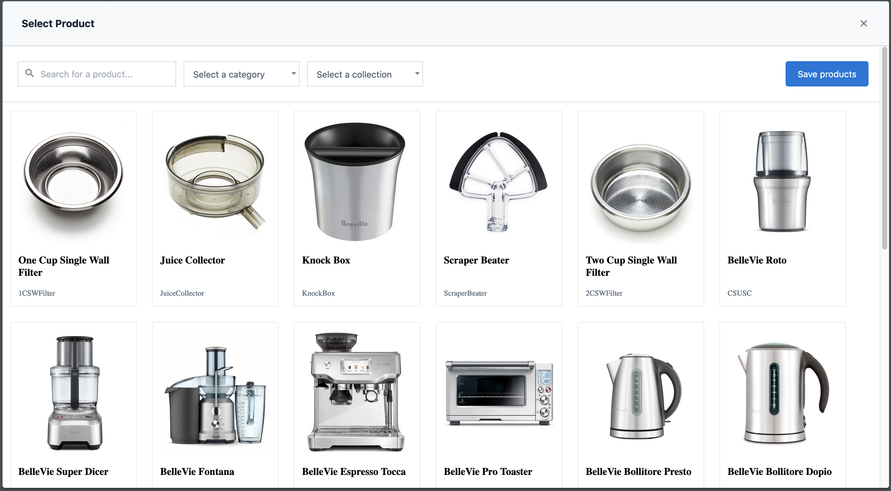
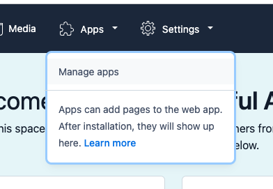
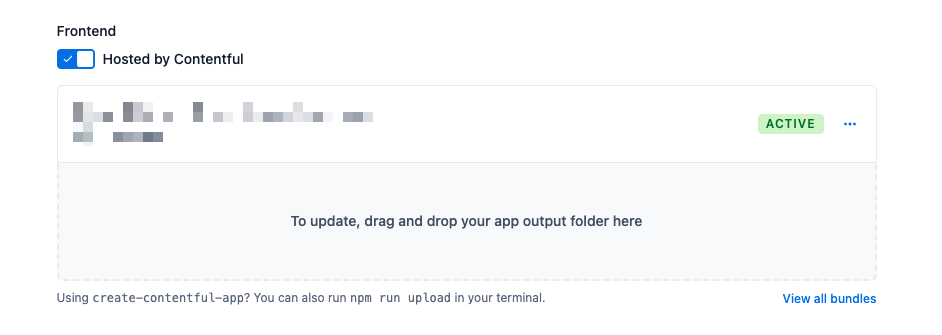
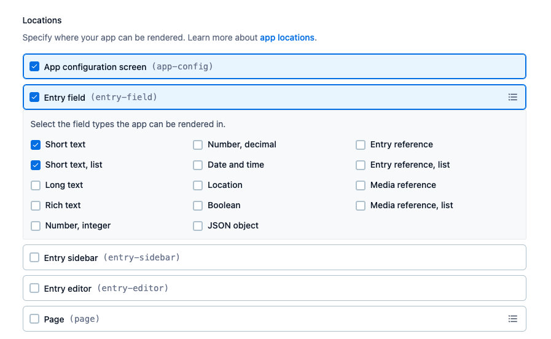
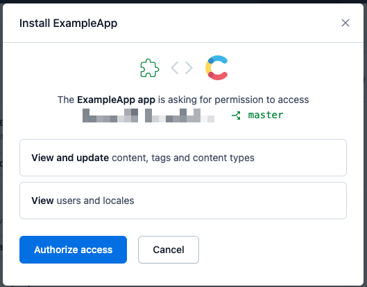

# About the Contentful ElasticPath integration

The Contentful-ElasticPath integration lets you link products by their SKU, or ID, to entries in Contentful. The Products must be `live and published` in ElasticPath. This integration authenticates to ElasticPath using an implicit token using your ElasticPath api Client ID.

Products that are linked from Elastic Path can be easily previewed via the Contentful web app, making it easier for content editors to use the most recently uploaded products across catalogs and sites.

### Features:

-  Link one or more SKUs, or IDs, of products inside Contentful
-  Full-text search for products in ElasticPath when using legacy product api integration
-  PCM Catalog integration supports filtering by loading _all_ PCM products and filtering locally in your browser. This may be a performance issue depending on the size of your Catalog. This is a limitation of PCM Catalog api as it does not support filtering. See https://github.com/myplanet/elastic-path-contentful-integration/issues/1
-  Preview selected products in Contentful

### Requirements:

To use the app, you will need a Elastic Path Cloud Commerce account.

### Screenshots:

## Usage

-  [Create a Content Model to reference Products](#create-a-content-model)

### 1 Configure App in Contentful

-  In Contentful, click on `Apps` in the top bar, and click `Manage apps`:

   

-  Now we can see the list of Apps installed, if any. We now need to manage the private apps. Click on `Manage private apps` in the top right:

   

-  Once in Private Apps, click "Create app" to create a new private App. You'll be prompted to give this new App a name. You can change this later if needed.

-  Once on the configuration screen:

   -  Enable Contentful to host the react app. Drag the build folder that was created earlier into the upload section, or click the upload section and navigate to the build folder location:

      

   -  Set the Locations to match the screenshot below.

      

-  Save the App

### 2 Install the App to your Contentful space

-  In Contenful on the Manage Apps screen, your new App should be listed in the `Available` section.
-  Click on your App's name to begin the process of installing the App to your current Contentful space.
-  Click `Authorize access` to grant your new App access to your Contentful resources.
   
-  The "App Config" screen will now display. This is where ElasticPath integration is configured. You'll need the following data from your ElasticPath dashboard: Client ID, Client Secret, and API base URL.
-  Configuration definitions:
   -  **Products Type**: The api to pull Product data from. Select `product` for ElasticPath's legacy catalog, or `pcm` for the ElasticPath PCM Catalog.
   -  **connector Value Type**: The field from the ElasticPath product that will be stored in Contenful when selecting a Product. For example, if `sku` is selected, when creating a content record in Contentful and selecting a product through this ElasticPath integration, the product's sku will be stored in the Contenful record.
   -  **Items fetched per request**: If using **Products Type** of `product`, this will be used as the limit of items returned per search request to ElasticPath. If using **Products Type** of `pcm`, up to 25 items will be returned per search request.
   -  **Products per page**: The number of ElasticPath products rendered in the search results grid.
   -  **PCM Channel**: The channel used to specify which PCM Catalog to query, based on your Catalog Rules configured in Elastic Path. Note, if your Catalog has a Rule defining both a Channel and a Tag, you will need to configure both in these settings.
   -  **PCM Tag**: The tag used to specify which PCM Catalog to query, based on your Catalog Rules configured in Elastic Path. Note, if your Catalog has a Rule defining both a Channel and a Tag, you will need to configure both in these settings.
-  Save and install the App. The next step is to create a Content Model that uses this App.

### Create a Content Model

To reference Elastic Path products from your Contentful entries:

-  Create or edit an existing Content Model.
-  Add a `Text` field.
   -  Select `List` if you want the content to contain a list of Products.
-  Under "Appearance" tab select your App and click Confirm.

To select a product on a content entity:

-  Navigate to the Content page.
-  Edit or create new content that contains the Field connected to your App.
-  Find the field and click on `Select product` or `Select products` if you installed a `list` field.
-  Scroll through the available product pages or search for a specific item by name and select the product you want. If it's a list of products, select all products you want then click "Save products" button.
-  Your selection should now show up like this:
   
